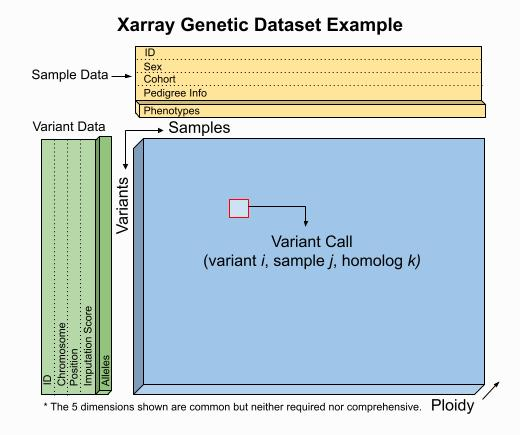

.. _getting_started:

**********************
Getting Started
**********************

.. contents:: Table of contents:
   :local:

Installation
------------

You can install sgkit with `pip` - there is no conda package yet. Python 3.7 or 3.8 is required.

    $ pip install sgkit

..

Overview
--------

Sgkit is a general purpose toolkit for quantitative and population genetics.
The primary goal of sgkit is to take advantage of powerful tools in the `PyData ecosystem <https://pydata.org/>`_
to facilitate interactive analysis of large-scale datasets. The main libraries we use are:

- `Xarray <http://xarray.pydata.org/en/stable/>`_: N-D labeling for arrays and datasets
- `Dask <https://docs.dask.org/en/latest/>`_: Parallel computing on chunked arrays
- `Zarr <https://zarr.readthedocs.io/en/stable/>`_: Storage for chunked arrays
- `Numpy <https://numpy.org/doc/stable/>`_: N-D in-memory array manipulation
- `Pandas <https://pandas.pydata.org/docs/>`_: Tabular data frame manipulation
- `CuPy <https://docs.cupy.dev/en/stable/>`_: Numpy-like array interface for CUDA GPUs

Data structures
---------------

Sgkit uses Xarray `Dataset <http://xarray.pydata.org/en/stable/data-structures.html#dataset>`_ objects to model genetic data.
Users are free to manipulate quantities within these objects as they see fit and a set of conventions for variable names,
dimensions and underlying data types is provided to aid in workflow standardization. The example below illustrates a
``Dataset`` format that would result from an assay expressible as `VCF <https://en.wikipedia.org/wiki/Variant_Call_Format>`_,
`PLINK <https://www.cog-genomics.org/plink2>`_ or `BGEN <https://www.well.ox.ac.uk/~gav/bgen_format/>`_.
This is a guideline however, and a ``Dataset`` seen in practice might include many more or fewer variables and dimensions.

..
  This image was generated as an export from https://docs.google.com/drawings/d/1NheB6LCvvkB4C0nAoSFwoYVZ3mtOPaseGmg_mZvcQ8I/edit?usp=sharing

The worked examples below show how to access and visualize data like this using Xarray. They also demonstrate
several of the sgkit conventions in place for representing common genetic quantities.

.. ipython:: python

    import sgkit as sg
    ds = sg.simulate_genotype_call_dataset(n_variant=1000, n_sample=250, n_contig=23, missing_pct=.1)
    ds

The presence of a single-nucleotide variant (SNV) is indicated above by the ``call_genotype`` variable, which contains
an integer value corresponding to the index of the associated allele present (i.e. index into the ``variant_allele`` variable)
for a sample at a given genome coordinate and chromosome. Every sgkit variable has a set of fixed semantics like this. For more
information on this specific variable and any others, see :ref:`genetic_variables`.

Data subsets can be accessed as shown here, using the features described in
`Indexing and Selecting Xarray Data <http://xarray.pydata.org/en/stable/indexing.html>`_:

.. ipython:: python

    import sgkit as sg
    ds = sg.simulate_genotype_call_dataset(n_variant=100, n_sample=50, n_contig=23, missing_pct=.1)

    # Subset the entire dataset to the first 10 variants/samples
    ds.isel(variants=slice(10), samples=slice(10))

    # Subset to a specific set of variables
    ds[['variant_allele', 'call_genotype']]

    # Extract a single variable
    ds.call_genotype[:3, :3]

    # Access the array underlying a single variable (this would return dask.array.Array if chunked)
    ds.call_genotype.data[:3, :3]

    # Access the alleles corresponding to the calls for the first variant and sample
    allele_indexes = ds.call_genotype[0, 0]
    allele_indexes

    ds.variant_allele[0, allele_indexes]

    # Get a single item from an array as a Python scalar
    ds.sample_id.item(0)

Larger subsets of data can be visualized and/or summarized through various
sgkit utilities as well as the Pandas/Xarray integration:

.. ipython:: python

    import sgkit as sg
    ds = sg.simulate_genotype_call_dataset(n_variant=1000, n_sample=250, missing_pct=.1)

    # Show genotype calls with domain-specific display logic
    sg.display_genotypes(ds, max_variants=8, max_samples=8)

    # A naive version of the above is also possible using only Xarray/Pandas and
    # illustrates the flexibility that comes from being able to transition into
    # and out of array/dataframe representations easily
    (ds.call_genotype[:5, :5].to_series()
        .unstack().where(lambda df: df >= 0, None).fillna('.')
        .astype(str).apply('/'.join, axis=1).unstack())

    # Show call rate distribution for each variant using Pandas
    df = ~ds.call_genotype_mask.to_dataframe()
    df.head(5)

    call_rates = df.groupby('variants').mean()
    call_rates

    @savefig call_rate_example.png width=6in height=3in
    call_rates.plot(kind='hist', bins=24, title='Call Rate Distribution', figsize=(6, 3))

This last example alludes to representations of missing data that are explained further in :ref:`missing_data`.

Genetic methods
---------------

Genetic methods in sgkit are nearly always applied to individual ``Dataset`` objects.  For a full list of
available methods, see :ref:`api_methods`.

In this example, the ``variant_stats`` method is applied to a dataset to compute a number of statistics
across samples for each individual variant:

.. ipython:: python

    import sgkit as sg
    ds = sg.simulate_genotype_call_dataset(n_variant=100, n_sample=50, missing_pct=.1)
    sg.variant_stats(ds, merge=False)

There are two ways that the results of every function are handled -- either they are merged with the provided
dataset or they are returned in a separate dataset.  See :ref:`dataset_merge` for more details.

.. _missing_data:

Missing data
------------

Missing data in sgkit is represented using a sentinel value within data arrays
(``-1`` in integer arrays and ``NaN`` in float arrays) as well as a companion boolean mask array
(``True`` where data is missing).  These sentinel values are handled transparently in
most sgkit functions and where this isn't possible, limitations related to it are documented
along with potential workarounds.

This example demonstrates one such function where missing calls are ignored:

.. ipython:: python

    import sgkit as sg
    ds = sg.simulate_genotype_call_dataset(n_variant=1, n_sample=4, n_ploidy=2, missing_pct=.3, seed=4)
    ds.call_genotype

    # Here, you can see that the missing calls above are not included in the allele counts
    sg.count_variant_alleles(ds).variant_allele_count

A primary design goal in sgkit is to facilitate ad hoc analysis. There are many useful functions in
the library but they are not enough on their own to accomplish many analyses. To that end, it is
often helpful to be able to handle missing data in your own functions or exploratory summaries.
Both the sentinel values and the boolean mask array help make this possible, where the sentinel values
are typically more useful when implementing compiled operations and the boolean mask array is easier to use
in a higher level API like Xarray or Numpy.  Only advanced users would likely ever need to worry
about compiling their own functions (see :ref:`custom_computations` for more details).
Using Xarray functions and the boolean mask is generally enough to accomplish most tasks, and this
mask is often more efficient to operate on due to its high on-disk compression ratio.  This example
shows how it can be used in the context of doing something simple like counting heterozygous calls:

.. ipython:: python

    import sgkit as sg
    import xarray as xr
    ds = sg.simulate_genotype_call_dataset(n_variant=1, n_sample=4, n_ploidy=2, missing_pct=.2, seed=2)
    # This array contains the allele indexes called for a sample
    ds.call_genotype

    # This array represents only locations where the above calls are missing
    ds.call_genotype_mask

    # Determine which calls are heterozygous
    is_heterozygous = (ds.call_genotype[..., 0] != ds.call_genotype[..., 1])
    is_heterozygous

    # Count the number of heterozygous samples for the lone variant
    is_heterozygous.sum().item(0)

    # This is almost correct except that the calls for the first sample aren't
    # really heterozygous, one of them is just missing.  Conditional logic like
    # this can be used to isolate those values and replace them in the result:
    xr.where(ds.call_genotype_mask.any(dim='ploidy'), False, is_heterozygous).sum().item(0)

    # Now the result is correct -- only the third sample is heterozygous so the count should be 1.
    # This how many sgkit functions handle missing data internally:
    sg.variant_stats(ds).variant_n_het.item(0)

Windowing
---------

It is common to compute statistics in windows along the genome. Some :ref:`api_methods` in sgkit
are "windowing aware" and will compute values for windows defined in a dataset. If no windows
are defined then the values will typically be computed for each variant. It is therefore
important to define windows *before* computing statistics on a dataset.

Windows are intervals that span the ``variants`` dimension in a dataset, and they are defined
using the :func:`sgkit.window` function. Currently only fixed-sized windows are supported, by
providing the ``size`` argument, which refers to the number of variants in each window. An
optional ``step`` argument may be provided to control the spacing between windows. By default,
it is the same as the ``size``, giving contiguous windows.

This example shows the effect of computing the diversity statistic: first with no windows defined,
then with windows.

.. ipython:: python
    :okwarning:

    import sgkit as sg
    import xarray as xr
    ds = sg.simulate_genotype_call_dataset(n_variant=100, n_sample=50)

    # Define a single cohort for all samples
    ds["sample_cohort"] = xr.DataArray(np.full(ds.dims['samples'], 0), dims="samples")

    # The diversity statistic is computed for every variant since no windows are defined
    sg.diversity(ds, merge=False)

    # Define windows of size 20 variants. This creates a new dimension called `windows`, and
    # some new variables for internal use.
    ds = sg.window(ds, 20)

    # The diversity statistic is now computed for every window
    sg.diversity(ds, merge=False)

Cohorts
-------

During analysis we often want to be able to group samples into populations, and compute statistics
based on these groups. Groups of samples are referred to as *cohorts* in sgkit.

Cohorts are defined by a mapping from samples to cohort index. The following example creates
a ``sample_cohort`` variable to group a dataset of ten samples into three cohorts. Note that first
value is ``-1``, which means the corresponding sample is not in any of the three cohorts, and
will be ignored when computing cohort statistics.

.. ipython:: python
    :okwarning:

    import sgkit as sg
    import xarray as xr
    ds = sg.simulate_genotype_call_dataset(n_variant=100, n_sample=10)
    ds["sample_cohort"] = xr.DataArray(np.array([-1, 0, 1, 1, 1, 1, 0, 2, 2, 2]), dims="samples")

Typically the ``sample_cohort`` variable is derived from a dataframe that has the sample/cohort
mapping.

Cohort-level statistics can have repeated ``cohorts`` dimensions. :func:`sgkit.Fst`, for example,
produces statistics for *pairs* of cohorts, which is represented as a variable with dimensions
``(windows, cohorts_0, cohorts_1)``, making it possible to read off the value of the statistic
for any pair of cohorts.

It's convenient to name cohorts, to avoid errors that can occur when using index values. This
example shows how to give cohorts names.

.. ipython:: python
    :okwarning:

    ds = sg.window(ds, 20)
    ds = sg.Fst(ds)

    cohort_names = ["Africa", "Asia", "Europe"]
    ds = ds.assign_coords({"cohorts_0": cohort_names, "cohorts_1": cohort_names})
    ds.stat_Fst.sel(cohorts_0="Africa", cohorts_1="Asia").values

Methods that work with cohorts will, by default, operate over all cohorts at once. Sometimes
however you might only want to run the computation for a subset of cohorts, in which case you can
explicitly specify the cohorts when calling the function.

Chaining operations
-------------------

`Method chaining <https://tomaugspurger.github.io/method-chaining.html>`_ is a common practice with Python
data tools that improves code readability and reduces the probability of introducing accidental namespace collisions.
Sgkit functions are compatible with this idiom by default and this example shows to use it in conjunction with
Xarray and Pandas operations in a single pipeline:

.. ipython:: python
    :okwarning:

    import sgkit as sg
    ds = sg.simulate_genotype_call_dataset(n_variant=100, n_sample=50, missing_pct=.1)

    # Use `pipe` to apply a single sgkit function to a dataset
    ds_qc = ds.pipe(sg.variant_stats).drop_dims('samples')
    ds_qc

    # Show statistics for one of the arrays to be used as a filter
    ds_qc.variant_call_rate.to_series().describe()

    # Build a pipeline that filters on call rate and computes Fst between two cohorts
    # for windows of size 20 variants
    (
        ds
        # Add call rate and other statistics
        .pipe(sg.variant_stats)
        # Apply filter to include variants present across > 80% of samples
        .pipe(lambda ds: ds.sel(variants=ds.variant_call_rate > .8))
        # Create windows of size 20 variants
        .pipe(lambda ds: sg.window(ds, 20))
        # Assign a "cohort" variable that splits samples into two groups
        .assign(sample_cohort=np.repeat([0, 1], ds.dims['samples'] // 2))
        # Compute Fst between the groups
        .pipe(sg.Fst)
        # Extract the Fst values for cohort pairs
        .stat_Fst.values
    )

This is possible because sgkit functions nearly always take a ``Dataset`` as the first argument, create new
variables, and then merge these new variables into a copy of the provided dataset in the returned value.
See :ref:`dataset_merge` for more details.

Chunked arrays
--------------

Chunked arrays are required when working on large datasets. Libraries for managing chunked arrays such as `Dask Array <https://docs.dask.org/en/latest/array.html>`_
and `Zarr <https://zarr.readthedocs.io/en/stable/>`_ make it possible to implement blockwise algorithms that operate
on subsets of arrays (in parallel) without ever requiring them to fit entirely in memory.

By design, they behave almost identically to in-memory (typically Numpy) arrays within Xarray and can be interchanged freely when provided
to sgkit functions. The most notable difference in behavior though is that operations on chunked arrays are `evaluated lazily <https://tutorial.dask.org/01x_lazy.html>`_.
This means that if an Xarray ``Dataset`` contains only chunked arrays, no actual computations will be performed
until one of the following occurs:

- `Dataset.compute <http://xarray.pydata.org/en/stable/generated/xarray.Dataset.compute.html>`_ is called
- `DataArray.compute <http://xarray.pydata.org/en/stable/generated/xarray.DataArray.compute.html>`_ is called
- The ``DataArray.values`` attribute is referenced
- Individual dask arrays are retrieved through the ``DataArray.data`` attribute and forced to evaluate via `Client.compute <https://distributed.dask.org/en/latest/api.html#distributed.Client.compute>`_, `dask.array.Array.compute <https://tutorial.dask.org/03_array.html#Example>`_ or by coercing them to another array type (e.g. using `np.asarray <https://numpy.org/doc/stable/reference/generated/numpy.asarray.html>`_)

This example shows a few of these features:

.. ipython:: python

    import sgkit as sg
    ds = sg.simulate_genotype_call_dataset(n_variant=100, n_sample=50, missing_pct=.1)

    # Chunk our original in-memory dataset using a blocksize of 50 in all dimensions.
    ds = ds.chunk(chunks=50)
    ds

    # Show the chunked array representing base pair position
    ds.variant_position

    # Call compute via the dask.array API
    ds.variant_position.data.compute()[:5]

    # Coerce to numpy via Xarray
    ds.variant_position.values[:5]

    # Compute without unboxing from xarray.DataArray
    ds.variant_position.compute()[:5]

Unlike this simplified example, real datasets often contain a mixture of chunked and unchunked arrays. Sgkit
will often load smaller arrays directly into memory while leaving large arrays chunked as a trade-off between
convenience and resource usage. This can always be modified by users though and sgkit functions that operate
on a ``Dataset`` should work regardless of the underlying array backend.

See `Parallel computing with Dask in Xarray <http://xarray.pydata.org/en/stable/dask.html#parallel-computing-with-dask>`_
for more examples and information, as well as the Dask tutorials on
`delayed array execution <https://tutorial.dask.org/03_array.html#dask.array-contains-these-algorithms>`_ and
`lazy execution in Dask graphs <https://tutorial.dask.org/01x_lazy.html>`_.

.. _genetic_variables:

Genetic variables
-----------------

TODO: Link to and explain ``sgkit.variables`` in https://github.com/pystatgen/sgkit/pull/276.

